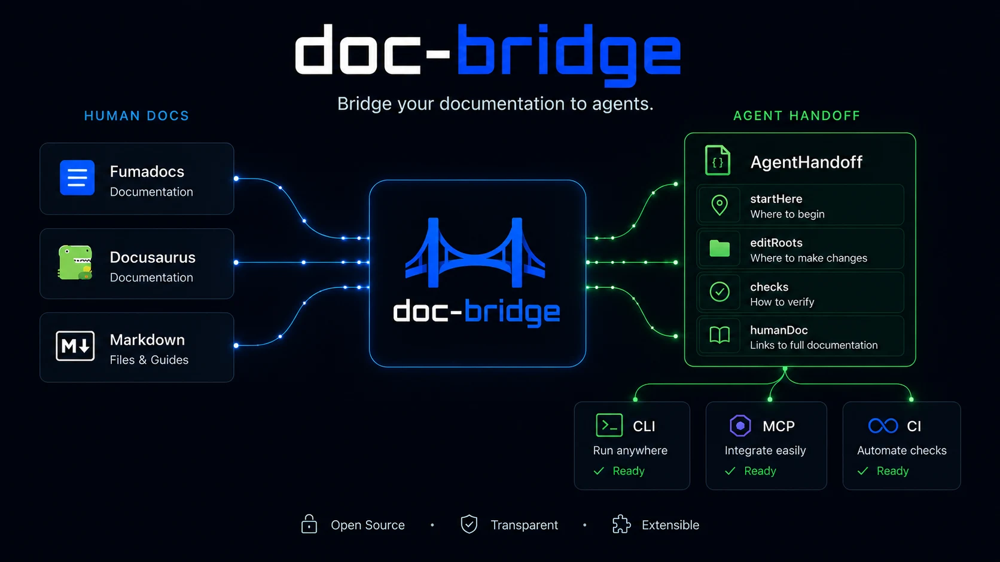
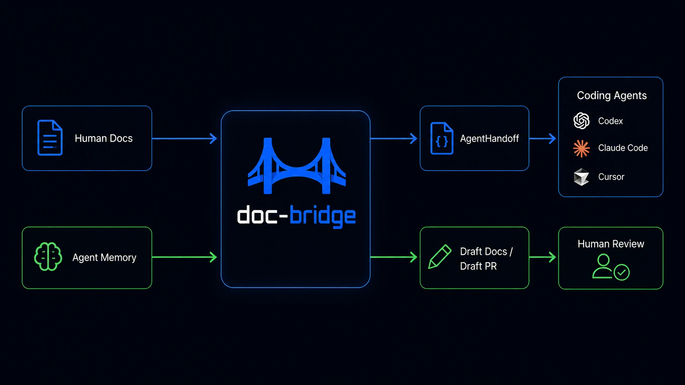
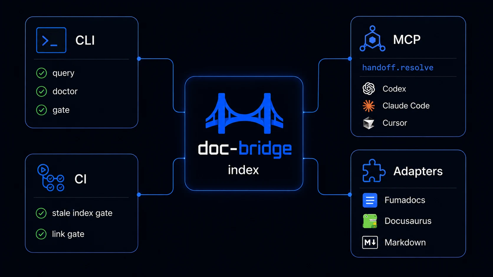

# doc-bridge

[](https://www.npmjs.com/package/@agentskit/doc-bridge)
[](https://github.com/AgentsKit-io/doc-bridge/actions/workflows/ci.yml)
[](https://agentskit-io.github.io/doc-bridge/)
[](LICENSE)
[](package.json)
[](dist/index.d.ts)

**npm:** [`@agentskit/doc-bridge`](https://www.npmjs.com/package/@agentskit/doc-bridge) · **CLI:** `ak-docs` · **Landing:** [agentskit-io.github.io/doc-bridge](https://agentskit-io.github.io/doc-bridge/)

**Turn your docs into executable handoffs for coding agents.**

doc-bridge reads your repo docs, ownership map, and human documentation site, then gives every agent the same answer:

- where to start reading
- which files/packages it may edit
- which checks prove the change
- which human docs explain the feature

It is not a wiki, not hosted RAG, and not another chat UI. The core works **without any LLM or API key**.



## Why teams use it

Agents are powerful, but most repo docs are written for humans. The result is familiar: the agent guesses ownership, edits the sibling package, runs the wrong test, or ignores the human guide that already explained the rule.

doc-bridge works in both directions:



| Direction | What it does | Command |
|-----------|--------------|---------|
| **Human docs → agents** | Turns Fumadocs, Docusaurus, markdown, and ownership docs into `AgentHandoff` | `ak-docs index` · `ak-docs query --agent` |
| **Agent memory → docs** | Reads `.agent-memory/**` and `.cursor/rules/*.mdc`, classifies what should become project docs, and drafts a human-reviewed promotion | `ak-docs memory ingest` · `classify` · `promote --pr` |

The handoff is a routing contract:

```json
{
  "startHere": "docs/for-agents/packages/auth.md",
  "editRoots": ["packages/auth"],
  "checks": ["pnpm --filter @demo/auth test"],
  "humanDoc": "/docs/guides/auth"
}
```

That contract works from the terminal, MCP, CI, and optional RAG/chat.

## 60-second proof

```bash
npm i -D @agentskit/doc-bridge
npx ak-docs demo --text
```

No config, no docs to read first. Output shows before/after, a real handoff, gate red→green, and the MCP snippet:

```
After (handoff.resolve / query --agent)
  ✓ target:  auth (packages/auth)
  ✓ start:   docs/for-agents/packages/auth.md
  ✓ edit:    packages/auth
  ✓ checks:  pnpm --filter @demo/auth test · pnpm --filter @demo/auth lint
  ✓ human guide: /docs/guides/auth

Gate: red → green
```

Monorepo fixture with auth + billing:

```bash
npx ak-docs demo --fixture monorepo --text
```

Full setup in your repo:

```bash
npx ak-docs init
npx ak-docs index
npx ak-docs query package example --agent
ak-docs mcp install --cursor   # wires MCP into .cursor/mcp.json
```

## What ships



| Surface | Use it for | Command / artifact |
|---------|------------|--------------------|
| **CLI** | Inspect ownership, search docs, run gates, ask local questions | `ak-docs query`, `search`, `ask`, `doctor`, `gate` |
| **MCP server** | Let Cursor, Claude Code, Codex-style agents resolve handoffs before editing | `ak-docs mcp`, `handoff.resolve` |
| **GitHub Action / CI** | Fail stale indexes and broken human-doc links on PRs | `AgentsKit-io/doc-bridge@v1.0.2` |
| **Documentation conformance** | Check the stable ecosystem standard with auditable evidence | `ak-docs conformance run documentation-standard-v1 --text` |
| **Doc adapters** | Link human docs to agent docs | `fumadocs`, `docusaurus`, `plain-markdown` |
| **Monorepo routing** | Discover workspaces and checks | `pnpm-monorepo` |
| **Memory pipeline** | Turn agent notes into reviewable documentation drafts | `memory ingest`, `classify`, `promote --pr` |
| **Optional RAG/chat** | Ground chat in the same handoff-first index | `@agentskit/rag`, `@agentskit/ink`, `ak-docs chat` |

See [docs/getting-started.md](docs/getting-started.md), [docs/mcp.md](docs/mcp.md), and [docs/examples.md](docs/examples.md).

## Why this exists

| Pattern | Gap |
|---------|-----|
| Wiki + RAG | Explains; weak on *where to act* and proof docs match code |
| AGENTS.md alone | Great static rules; no ownership index, gates, or human bridge |
| Context7-class tools | Library docs for the model; not *your* monorepo routing |

doc-bridge ships **AgentHandoff** JSON:

```json
{
  "type": "agent-handoff",
  "startHere": "docs/for-agents/packages/auth.md",
  "editRoots": ["packages/auth"],
  "checks": ["pnpm --filter @demo/auth test"],
  "humanDoc": "/docs/guides/auth",
  "bridge": { "humanDoc": "linked" }
}
```

When a human guide is missing, handoffs surface it as a feature:

```json
{
  "bridge": {
    "humanDoc": "missing",
    "action": "ak-docs bootstrap agent-docs"
  },
  "notes": ["Human guide missing for billing. Run: ak-docs bootstrap agent-docs"]
}
```

## Four loops (with real commands)

| Loop | Command | What you see |
|------|---------|--------------|
| **Act** | `ak-docs query package auth --agent` | `editRoots`, `checks`, `startHere` |
| **Bridge** | `ak-docs bootstrap agent-docs` | Draft agent docs from human site; `bridge.humanDoc` in handoff |
| **Learn** | `ak-docs memory classify` → `promote` | HITL draft for agent corpus |
| **Explain** | `ak-docs ask "auth is broken in staging"` | Ownership match + handoff preview + next commands |

```bash
ak-docs ask "who owns schemas"
# Best match: ownership os-core
# Handoff preview
#   start:  docs/for-agents/packages/os-core.md
#   edit:   packages/os-core
#   checks: pnpm --filter os-core lint · pnpm --filter os-core test
```

## Coverage your team checks daily

```bash
ak-docs doctor --text
ak-docs doctor --badge          # shields.io markdown for README
ak-docs index --watch           # keep index fresh while editing docs
```

```
Score: 82/100 (B)
  Agent docs:      8/10 (80% handoff-ready)
  Human guides:    6/10 (60% bridged)
  Gates:           3/3 passing

Next actions
  → ak-docs bootstrap agent-docs
  → ak-docs query package billing --agent
```

## Agent uses it alone

1. **MCP auto-wire:** `ak-docs mcp install --cursor`
2. **Skill/rule:** paste [docs/skills/doc-bridge.md](docs/skills/doc-bridge.md) into Cursor rules — agents call `handoff.resolve` before editing `packages/*`
3. **Handoff is the next step:** `startHere`, `checks`, and `bridge` are in the JSON/MCP response

## CI as first-class citizen

Reuse the bundled GitHub Action on every PR:

```yaml
- uses: AgentsKit-io/doc-bridge@v1.0.2
  with:
    config-path: doc-bridge.config.json
```

 

Run `ak-docs doctor --badge` locally to refresh — or `pnpm coverage:badge` in CI.

Or locally:

```bash
ak-docs index && ak-docs gate run
```

Gate fails with `Index is stale. Run: ak-docs index` — same check in CI annotations.

## Product surface

### Core — always (no LLM)

| Surface | Purpose |
|---------|---------|
| **Demo** | `ak-docs demo` — bundled fixture, no setup |
| **Doctor** | Coverage score, missing humanDoc/agent doc, next actions |
| **Index** | `DocBridgeIndex` + `contentHash` + `llms.txt` + capabilities |
| **CLI** | `query` / `search` / `list` / `ask` / `gate` / `memory` / `bootstrap` |
| **MCP** | `handoff.resolve`, `doc.search`, `doc.get`, `gate.status`, … |
| **Gates** | Freshness, human-link validation, optional OKF style |
| **Adapters** | `pnpm-monorepo`, `fumadocs`, `docusaurus`, `plain-markdown` |

### Optional AgentsKit peers

```bash
npm i -D @agentskit/rag @agentskit/ink @agentskit/adapters @agentskit/memory react
ak-docs rag ingest && ak-docs chat
```

See **[docs/chat-and-rag.md](docs/chat-and-rag.md)**.

## Who uses it (public)

Designed for and dogfooded on open AgentsKit surfaces:

| Surface | Link |
|---------|------|
| **for-agents** | [agentskit.io/docs/for-agents](https://www.agentskit.io/docs/for-agents) |
| **Registry** | [registry.agentskit.io](https://registry.agentskit.io/) |
| **Playbook** | [playbook.agentskit.io](https://playbook.agentskit.io/llms.txt) |
| **AgentsKit Chat** | [chat framework](https://github.com/AgentsKit-io/agentskit-chat) |
| **AgentsKit OS** | [akos.agentskit.io](https://akos.agentskit.io) |
| **Code Review** | [repository-native CLI](https://github.com/AgentsKit-io/code-review-cli) |
| **This repo** | CI green · `ak-docs gate run` on every PR |

**Playbook pattern:** [`docs/playbook/doc-bridge-pattern.md`](docs/playbook/doc-bridge-pattern.md) — export with `ak-docs playbook pattern --text`

## Configuration examples

| Profile | Example |
|---------|---------|
| Solo markdown | [`examples/minimal-plain-markdown.config.ts`](examples/minimal-plain-markdown.config.ts) |
| pnpm monorepo | [`examples/pnpm-monorepo.config.ts`](examples/pnpm-monorepo.config.ts) |
| Demo monorepo | [`examples/demo-monorepo/`](examples/demo-monorepo/) |
| Fumadocs + chat | [`examples/fumadocs-with-chat.config.ts`](examples/fumadocs-with-chat.config.ts) |

Contract: [`docs/spec/config-v1.md`](docs/spec/config-v1.md) · CLI: [`docs/spec/cli.md`](docs/spec/cli.md) · MCP: [`docs/mcp.md`](docs/mcp.md) · Skill: [`docs/skills/doc-bridge.md`](docs/skills/doc-bridge.md) · Pattern: [`docs/playbook/doc-bridge-pattern.md`](docs/playbook/doc-bridge-pattern.md) · Recipes: [`docs/recipes/index-pipeline.md`](docs/recipes/index-pipeline.md)

## Learn loop — memory → draft PR

```bash
ak-docs memory ingest
ak-docs memory classify
ak-docs memory promote --pr --dry-run   # preview gh commands
ak-docs memory promote --pr              # opens draft PR via gh
```

## Status

**v1.0.2 stable** — doctor + CI + skill boring-reliable. Landing, Playbook pattern, full Tier A/B/C shipped.

```bash
pnpm install && pnpm build && pnpm test
pnpm smoke:ollama    # optional — skips if Ollama/peers unavailable
```

**Landing:** https://agentskit-io.github.io/doc-bridge/

## Contributing

Issues and PRs are welcome. Start here:

| Need | Doc |
|------|-----|
| Local setup, tests, release flow | [CONTRIBUTING.md](CONTRIBUTING.md) |
| Vulnerability reports | [SECURITY.md](SECURITY.md) |
| Community standards | [CODE_OF_CONDUCT.md](CODE_OF_CONDUCT.md) |
| Release history | [CHANGELOG.md](CHANGELOG.md) |
| Product positioning | [docs/POSITIONING.md](docs/POSITIONING.md) |

## License

[MIT](LICENSE)
