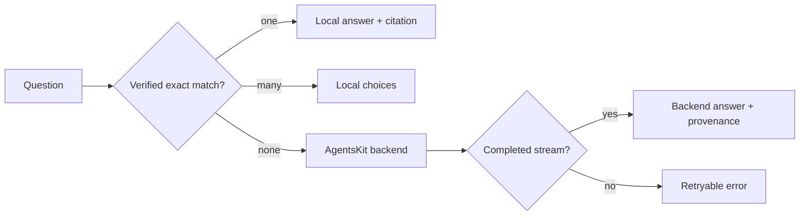

# Chat and RAG (Layer 1)

Layer 0 (index, handoff, MCP, gates, memory pipeline) never requires an LLM.

Layer 1 is **opt-in** and dogfoods public AgentsKit packages:

| Peer | Role |
|------|------|
| `@agentskit/rag` | Chunk, embed, ingest, search |
| `@agentskit/memory` | `fileVectorMemory` under `.doc-bridge/vectors` |
| `@agentskit/adapters` | Chat model + embedder (ollama, openai, …) |
| `@agentskit/ink` | Terminal chat UI (`ak-docs chat`) |
| `react` | Required by Ink |

## Public docs chat: deterministic before backend

The documentation portal uses `@agentskit/chat` (root), `@agentskit/chat/react`,
and `@agentskit/chat/protocol` directly — the consolidated AgentsKit Chat 0.3.x
surface. It does not recreate chat lifecycle or session state.

At build time, `scripts/build-docs-artifacts.mjs` reads the fresh
`.doc-bridge/index.json` and canonical `docs/**` corpus, then writes:

- `deterministic/knowledge.json` — exact commands, documents, and real ownership handoffs;
- `deterministic/site-config.json` — trusted artifact hash plus fallback policy;
- `llms.txt`, `llms-full.txt`, and `raw/**` — model-friendly public sources.

The browser verifies the SHA-256 content hash before using the artifact. A
known exact question answers locally with provenance. Multiple exact matches
return local choices. Only a genuine miss reaches the configured backend, and
the UI reports a backend answer only after a successful completed stream.



## Trust model

1. **`handoffFirst`** (default): if the question mentions a known package id, attach deterministic AgentHandoff context before the model answers.
2. RAG retrieves from the indexed agent corpus (and configured sources).
3. CI gates still decide merge truth — chat never auto-writes docs.

## Commands

```bash
ak-docs rag ingest
ak-docs rag search "<query>"
ak-docs chat
ak-docs ask "<question>" --chat
```

Missing peers produce an install hint instead of a silent no-op.

**Ollama walkthrough:** [ollama-demo.md](./ollama-demo.md) · `pnpm smoke:ollama`

## Providers

| provider | Notes |
|----------|--------|
| `ollama` | Best zero-cloud path; uses `ollamaEmbedder` (e.g. `nomic-embed-text`) |
| `openai` | Chat + `text-embedding-3-small` |
| `openrouter` | Chat via OpenRouter |
| `anthropic` | Chat; embeddings currently need `OPENAI_API_KEY` or use ollama |

## Config sketch

See `examples/fumadocs-with-chat.config.ts`.

## When not to use Layer 1

- You only need routing for coding agents → Layer 0 is enough.
- You already have another RAG stack → keep Layer 0 handoffs; skip peers.
