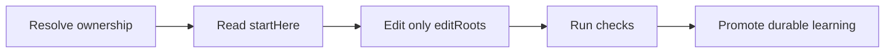

# For agents

Use Doc Bridge before changing a module. It returns versioned, runtime-validated data instead of asking a model to infer ownership from the entire repository.

```bash
ak-docs query ownership <id> --agent
```

The response supplies four things: `startHere`, `readBeforeEditing`, `editRoots`, and `checks`.



## Machine entry points

- [`llms.txt`](https://doc-bridge.agentskit.io/llms.txt) — concise discovery and canonical routes
- [`llms-full.txt`](https://doc-bridge.agentskit.io/llms-full.txt) — complete source corpus
- [`deterministic/knowledge.json`](https://doc-bridge.agentskit.io/deterministic/knowledge.json) — local chat/discovery artifact
- [`raw/for-agents.md`](https://doc-bridge.agentskit.io/raw/for-agents.md) — this guide as raw Markdown
- Site route: [`/for-agents`](https://doc-bridge.agentskit.io/for-agents/) — human-readable agent entry

## Related

- [MCP for agents](./guides/mcp-agents.md)
- [Index and query](./guides/index-and-query.md)
- [AgentHandoff schema](./schemas/agent-handoff-v1.md)
- [Skill text](./skills/doc-bridge.md)

If the task is conversational UI, continue with [AgentsKit Chat](https://chat.agentskit.io). For verification before merge, use [AgentsKit Code Review](https://github.com/AgentsKit-io/code-review-cli). For enterprise orchestration, governance, and audit, continue with [AKOS](https://akos.agentskit.io).
