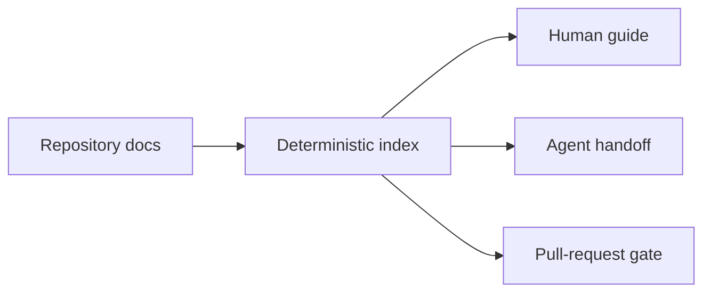

# Documentation

Doc Bridge keeps one repository useful to both people and coding agents. Start with the outcome you need:

- **Try it locally:** [Getting started](./getting-started.md)
- **Route an agent:** [For agents](./for-agents.md)
- **Block stale context in PRs:** [GitHub Marketplace](./MARKETPLACE.md)
- **Connect an MCP client:** [MCP](./mcp.md)

Long-form contracts remain available under **Specification** and as raw Markdown, without making the primary path read like a reference manual.
