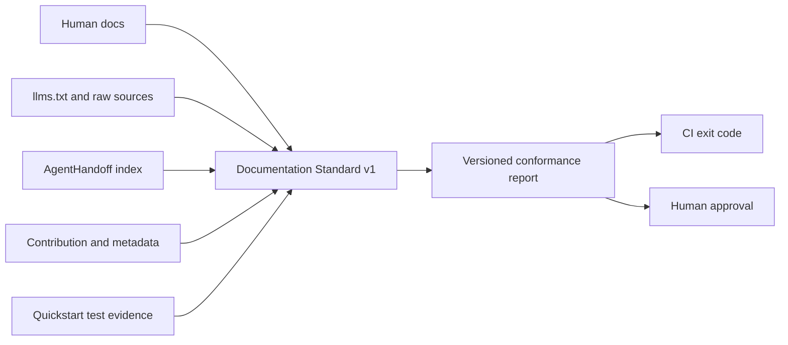

# Documentation Standard v1

Status: **proposed — HITL approval required before stable publication**  
Profile ID: `documentation-standard-v1`  
Schema version: `1`

Documentation Standard v1 is a deterministic Doc Bridge conformance profile for
documentation properties in the AgentsKit ecosystem. It turns the shared quality
expectations into local evidence that humans, CI, and agents can inspect without a model,
API key, or network request.



## Rule set

| Rule | Level | Passing evidence |
|---|---|---|
| `human-docs` | Required | A configured human adapter discovers at least one non-agent document |
| `llms-and-raw-source` | Required | Generated `llms.txt` and every declared raw source exist and are non-empty |
| `agent-handoffs` | Required | Every emitted handoff has `startHere`, edit roots, checks, and a linked/external human bridge |
| `contribution` | Required | At least one declared contribution guide exists and is non-empty |
| `metadata` | Required | Declared metadata files exist and contain every configured marker |
| `cross-links` | Required | Every declared ecosystem URL occurs in at least one declared source file |
| `tested-quickstarts` | Required | Each quickstart maps a doc to a test file, identifying test markers, and a CI command |
| `visual-explanations` | Recommended | Every declared image or animation asset exists |
| `structured-diagrams` | Recommended | Declared diagram source exists and contains its configured marker |

Recommended failures remain visible but do not fail the command. Required failures return
exit code 1 unless an approved exception applies.

## Approved exceptions

Exceptions are explicit audit records, not hidden exclusions. A valid exception requires
the rule ID, a substantive reason, the approver, and a tracking URL:

```json
{
  "ruleId": "structured-diagrams",
  "reason": "The interactive visual already expresses this relationship more clearly.",
  "approvedBy": "Documentation Working Group",
  "trackingUrl": "https://github.com/AgentsKit-io/example/issues/123"
}
```

The report uses status `excepted`; it never rewrites an exception as an ordinary pass.

## Configuration

```json
{
  "conformance": {
    "documentationStandardV1": {
      "rawSources": ["README.md", "docs/getting-started.md"],
      "contributionPaths": ["CONTRIBUTING.md"],
      "metadata": [
        { "path": "docs/index.html", "contains": ["<title>", "name=\"description\""] }
      ],
      "links": [
        { "url": "https://www.agentskit.io", "paths": ["README.md"] }
      ],
      "quickstarts": [
        {
          "id": "demo",
          "doc": "README.md",
          "test": "tests/demo.test.ts",
          "command": "pnpm vitest run tests/demo.test.ts",
          "testContains": ["runs the demo"]
        }
      ],
      "visuals": ["docs/assets/overview.webp"],
      "diagrams": [
        { "path": "docs/architecture.md", "contains": ["```mermaid"] }
      ],
      "exceptions": []
    }
  }
}
```

The profile does not execute the declared quickstart command. The test-evidence file and
identifying markers prove that the quickstart has a repository test; the normal CI suite
executes that test. This avoids turning documentation configuration into an arbitrary
command-execution surface.

## Run the profile

```bash
ak-docs conformance run documentation-standard-v1 --text
ak-docs conformance run documentation-standard-v1 --json
ak-docs gate run documentation-standard-v1
```

JSON output is the stable automation surface. Text output sends the same evidence in a
human-scannable form. Both return 0 when required rules pass or are explicitly excepted,
and 1 when a required rule fails.

## Adoption and stability

The Doc Bridge repository is the first real fixture and dogfoods the profile in its normal
`ak-docs gate run`. Other ecosystem repositories adopt it in their documentation slices.
The rule set remains `proposed` until HITL approval is recorded in
[issue #27](https://github.com/AgentsKit-io/doc-bridge/issues/27). Stable publication also
waits for the canonical ecosystem contract in
[AgentsKit #1200](https://github.com/AgentsKit-io/agentskit/issues/1200).
